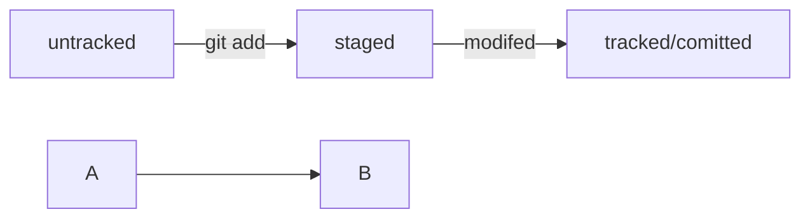

# Шпаргалка git

## **Инициализация репозитория**
```git init```
(от англ. initialize, «инициализировать») - инициализируй
репозиторий.
## **Подготовка файла к коммиту**
(от англ. add, «добавить») - подготовь файл
```git add todo.txt```
коммиту;
todo. txt
K
```git add --all``` 
(от англ. add, «добавить» + all, «всё») — подготовь к коммиту сразу
все файлы, в которых были изменения, и все новые файлы;
```git add```
- подготовь к коммиту текущую папку и все файлы в ней.
## **Создание коммита**
```git commit -m``` "Комментарий к коммиту."
(от англ. commit, «совершать»,
«фиксировать» + message, «сообщение») - сделай коммит и оставь комментарий,
чтобы было проще понять, какие изменения внесены.
Просмотр информации о коммитах
(от англ. /од, «журнал [записей]») — выведи подробную историю коммитов.
```git log```

## **Просмотр состояния файлов репозитория.**
```git status```
(от англ. status, «статус», «состояние») - покажи текущее состояние
Синхронизация локального и удалённого репозиториев

```git remote add origin https://github.com/YandexPracticum/first-project.git``` 
(от англ. remote, «удалённый» + add, «добавить») — привяжи локальный репозиторий 
к удалённому с URL https://github.com/YandexPracticum/first-project.git;
```git remote -v``` (от англ. verbose, «подробный») — проверь, что репозитории действительно связались;
```git push -u origin main``` (от англ. push, «толкать») — в первый раз загрузи все коммиты из локального репозитория в удалённый с названием origin.
💡 Ваша ветка может называться master, а не main. Подправьте команду, если это необходимо.
```git push``` (от англ. push, «толкать») — загрузи коммиты в удалённый репозиторий после того, как он был привязан с помощью флага -u.

## **Клонирование**
```git clone git@github.com:TheGreatOwner/the-great-project.git``` 
(от англ. clone, «клон», «копия») — склонируй репозиторий с URL the-great-project.git 
из аккаунта TheGreatOwner на мой локальный компьютер.
## **Форк**
**Форк** — операция, которая не связана с Git напрямую и выполняется через графический интерфейс GitHub (кнопка Fork в правом верхнем углу страницы репозитория). «Форк» создаёт независимую копию репозитория со всеми файлами, коммитами и ветками в аккаунте GitHub. Такая копия будет полностью независима. Внесённые изменения не будут синхронизированы с исходным репозиторием.
💡 Комбинацию **форк** + **_clone_** часто используют для внесения изменений в публичные репозитории. В этом случае **форк** становится подготовительным этапом перед клонированием чужого репозитория на локальный компьютер.
Если репозиторий приватный или это репозиторий вашей компании, при работе с ним достаточно **_clone_**.
## **HEAD**
**HEAD** - это файл в ```.git```, в файле - ссылка, по ссылке - хеш. Это синоним хеша **последнего** коммита.
Если передать его в качестве параметров, git поймет вас
## **Хеш** — идентификатор коммита 
**Хеширование** (от англ. hash, «рубить», «крошить», «мешанина») — это способ преобразовать набор данных и получить их «отпечаток» (англ. fingerprint).
**Информация о коммите** — это набор данных: когда был сделан коммит, содержимое файлов в репозитории на момент коммита и ссылка на предыдущий, или родительский (англ. parent), коммит. Git хеширует (преобразует) эту информацию с помощью алгоритма SHA-1 (от англ. Secure Hash Algorithm — «безопасный алгоритм хеширования») и получает для каждого коммита свой **уникальный хеш — результат хеширования.**
Если хеш получить дважды для одного и того же набора входных данных, то результат будет гарантированно одинаковый;
Если хоть что-то в исходных данных поменяется (хотя бы один символ), то хеш тоже изменится (причём сильно).
Git хранит таблицу соответствий хеш → информация о коммите. Если вы знаете хеш, вы можете узнать всё остальное: автора и дату коммита и содержимое закоммиченных файлов. Можно сказать, что хеш — основной идентификатор коммита.
При работе с Git хеши будут встречаться вам регулярно. Их можно будет передавать в качестве параметра разным Git-командам, чтобы указать, с каким коммитом нужно произвести то или иное действие.
Все хеши и таблицу хеш → информация о коммите Git сохраняет в служебные файлы. Они находятся в скрытой папке .git в репозитории проекта.

## **Исследуем лог**

После вызова ```git log``` появляется список коммитов с их описанием.
Вот из каких элементов состоит описание:
1) Строка из цифр и латинских букв после слова commit — это уже знакомый вам хеш коммита.
2) Author — имя автора и его электронная почта.
3) Date — дата и время создания коммита.
4) Сообщение к коммиту.
Вот так выглядит описание первого коммита в репозитории Git
1) ```commit e83c5163316f89bfbde7d9ab23ca2e25604af290```
2) ```Author: Linus Torvalds <torvalds@linux-foundation.org>```
3) ```Date:   Thu Apr 7 15:13:13 2005 -0700```
4)  ```Initial revision of "git", the information manager from hell```

Если в репозитории уже много коммитов — например, сотни или тысячи, — пригодится **сокращённый лог**. С ним можно быстро найти нужный коммит по описанию.
**Сокращённый лог** вызывают командой ```git log``` с флагом ```--oneline``` (англ. «одной строкой»). При этом в терминале появятся только первые несколько символов хеша каждого коммита и комментарии к ним.
**Сокращённый хеш** (первые несколько символов полного) можно использовать точно так же, как и полный. Для этого команда ```git log --oneline``` автоматически подбирает такую длину сокращённых хешей, чтобы они были уникальными в пределах репозитория и Git всегда мог понять, о каком коммите идёт речь.
💡 Обратите внимание: если выход из просмотра логов не произошёл автоматически, нажмите клавишу Q (от англ. Quit — «выйти») в английской раскладке клавиатуры.


## **Оформление сообщений к коммитам**
То, как написаны сообщения к коммитам, тоже может подчиняться определённым правилам. Иногда эти правила продиктованы культурой команды, а иногда техническими ограничениями. Например, в выводе команды ```git log --oneline``` умещается максимум 72 первых символа сообщения, поэтому многие правила включают пункт: «Сообщение не должно быть длиннее 72 символов».
У каждого коммита в Git есть сообщение — то, что передаётся после параметра ```-m```. Например: ```git commit -m "Добавить урок про оформление сообщений коммитов" ```
Сообщение коммита должно помочь определить, что внутри. Например, надпись «всякое разное» не очень полезная. Сообщение коммита «небольшие исправления» тоже: непонятно, что было исправлено в таком коммите и зачем.
Есть **общие рекомендации** по тому, как правильно составить сообщение. Оно должно быть:
1) ***относительно коротким***, чтобы его было легко прочитать
2) ***информативным***
Вот пример **полезного сообщения** в репозитории новостного сайта: ***"Исправление опечатки в заголовке главной страницы на хорватском"***. Такое сообщение даёт много информации:
Исправление опечатки значит, что исправлена ошибка, которая была допущена при наборе. Такое исправление не меняет смысл. То есть, например, главному редактору не нужно перепроверять этот заголовок.
На хорватском говорит о том, что переводчикам на другие языки этот коммит можно смело пропускать.
В заголовке главной страницы указывает, где произошли изменения. Если, например, кто-то зайдёт на сайт и ему не понравится новый заголовок, он легко найдёт по истории (```git log```) автора этого коммита и спросит у него, почему заголовок теперь такой.
Пример **плохого сообщения** для того же коммита: ***"Исправлена опечатка."*** Это сообщение даёт мало информации. В такой коммит придётся «заглядывать» — разбираться, что именно поменялось и зачем.

## **Стили оформления**
Все люди разные и у всех есть предпочтения — в том числе, как формулировать сообщения коммитов. Кто-то использует **инфинитивы**: ***"Исправить сообщение об ошибке E123"***, кто-то — **глаголы в прошедшем времени**: ***"Исправил…"***, кто-то — **существительные**: ***"Исправление…"***.
Чтобы упростить работу, команды или даже целые компании часто договариваются об определённом стиле (то есть о правилах) оформления сообщений коммитов.
Например, правила могут быть такие:
1) длина сообщения от 30 до 72 символов;
2) первое слово — глагол в инфинитиве («исправить», «дополнить», «добавить» и другие);
3) и так далее.

**Корпоративный**
Во многих компаниях применяется **Jira** — система для организации проектов и задач. У каждой задачи в Jira есть ***идентификатор*** из нескольких заглавных латинских букв и номера. Например, LGS-239 значит, что это 239-я задача в проекте LGS (сокращение от англ. logistics — «логистика»).
В ***корпоративном*** стиле в начале сообщения обычно указывают Jira-ID, а после — текст сообщения.
```$ git commit -m "LGS-239: Дополнить список пасхалок новыми числами" ```
Какие-то команды могут договариваться, с какой части речи начинать сообщение и какой длины оно должно быть, какие-то — нет. Но требование о наличии Jira-ID обычно строгое: оно позволяет автоматически связывать коммиты с задачами и проектами.

**Conventional Commits**
Стандарт **Conventional Commits** (англ. «соглашение о коммитах») отличается качественной документацией и подробной проработкой. Он подходит для репозиториев с исходным кодом программ. А вот использовать его для других типов проектов было бы неудобно.

**Conventional Commits** предлагает такой формат коммита: ```<type>: <сообщение>```. Первая часть ```type``` — это тип изменений. Таких типов достаточно много. Вот два примера:
```feat``` (сокращение от англ. feature) — для новой функциональности;
```fix``` (от англ. «исправить», «устранить») — для исправленных ошибок.
Например, сообщение может быть таким.
```git commit -m "feat: добавить подсчёт суммы заказов за неделю" ```

**GitHub-стиль**
**GitHub** можно использовать не только для хранения файлов проекта, но и для ведения списка задач (англ. issue) этого проекта. Если ***коммит*** «закрывает» или «решает» какую-то задачу, то в его сообщении удобно указывать ссылку на неё. Для этого в любом месте сообщения нужно указать ```#<номер задачи>```. Например, вот так.
```$ git commit -m "Исправить #334, добавить график температуры" ```
В таком случае ***GitHub*** свяжет коммит и задачу.
💡 Для ***сообщений*** на ***русском языке*** часто рекомендуют использовать ***инфинитивы***. Например: Добавить тесты для PipkaService, Исправить ошибку #123 и так далее.
Для ***сообщений*** на ***английском*** рекомендуется использовать ***повелительное наклонение*** (англ. imperative). Например: ```Use library mega_lib_300```, ```Fix exit button``` и так далее.
Эти рекомендации сложились исторически, и им следуют многие проекты.

## **Как исправить коммит**
Иногда в только что выполненном коммите нужно что-то поменять: например, добавить ещё пару файлов или заменить сообщение на более информативное.
В таком случае можно внести правки в уже сделанный коммит с помощью опции ```--amend``` (от англ. amend — «исправить», «дополнить») у команды ```commit```: ```git commit --amend```. Разберём, как она работает.

**Дополнить коммит новыми файлами** — ```git commit --amend --no-edit```
Создайте тренировочный репозиторий для отработки команды.
```$ mkdir ~/dev/commit-amend-fun```
```$ cd ~/dev/commit-amend-fun```
```$ git init```
Представьте, что делаете небольшой сайт и для этого создали файл-страницу main.html, а также файл со стилями common.css.
```$ touch main.html```
```$ touch common.css```
// дальше отредактировали оба файла 
В какой-то момент вы забыли о файле common.css и добавили в коммит только main.html.
```$ git add main.html```
```$ git commit -m "Добавить главную страницу"```
```$ git log --oneline```
```777fec3 Добавить главную страницу```
У вас будут другие хеши коммитов. Файл common.css так и остался «висеть» в untracked. В этом легко убедиться, если вызвать ```git status```.
```$ git status```
```On branch main```
```Untracked files:```
  ```(use "git add <file>..." to include in what will be committed)```
          ```common.css```

```nothing added to commit but untracked files present (use "git add" to track) ```
Дополните последний коммит забытым файлом common.css с помощью опции --amend.
```$ git add common.css```
добавили файл common.css в список на коммит как обычно, но вместо команды ```commit -m '...'``` будет:
```$ git commit --amend --no-edit```

```$ git log --oneline```
```8340eb2 Добавить главную страницу```
Коммит в истории всё ещё один (но у него новый хеш) 
С опцией ```--amend``` команда ```commit``` создаст новый коммит, которым заменит ваш последний. При этом будут учтены изменения как старого коммита, так и нового. То есть фактически к старым изменениям просто добавится файл ```common.css```. Из-за такого эффекта, про операцию ```amend``` часто говорят, что она редактирует/дополняет последний коммит. Однако нужно всегда помнить, что при её выполнении создаётся новый коммит, который будет иметь новый хеш. Поэтому не изменяйте ваш последний коммит, если вы уже отправили его в общий репозиторий.
Обратите внимание на опцию ```--no-edit```. Она сообщает команде ```commit```, что сообщение коммита нужно оставить как было.

**Изменить сообщение коммита — ```git commit --amend -m "Новое сообщение"```**
Может быть и так, что добавлять новые файлы в коммит не нужно, зато понадобилось изменить сообщение. Допустим, хочется заменить сообщение ***"Добавить главную страницу"*** на ***"Добавить главную страницу и стили."*** 
Сделать это можно через commit --amend с флагом -m.
```$ git commit --amend -m "Добавить главную страницу и стили"```
```$ git log --oneline```
```a31fa24 Добавить главную страницу и стили ```
Хеш коммита снова поменялся, потому что взамен старого был создан новый коммит с новым сообщением. При этом файлы в коммите остались те же: ```main.html``` и ```common.css.```

## **Как откатиться назад, если «всё сломалось»**
**Выполнить unstage изменений — ```git restore --staged <file>```**

Допустим, вы создали или изменили какой-то файл и добавили его в список «на коммит» (staging area) с помощью ```git add```, но потом передумали включать его туда. Убрать файл из staging поможет команда ```git restore --staged <file>``` (от англ. restore — «восстановить»).
 В выводе команды git status есть подсказка в скобках: ```use "git restore --staged <file>..."``` to unstage. Так что, даже если вы и забыли эту команду, Git напомнит вам.
 В терминале это будет выглядеть примерно так.
```$ touch example.txt``` # создали ненужный файл
```$ git add example.txt``` # добавили его в staged
```$ git status``` # проверили статус
```Changes to be committed:```
```  (use "git restore --staged <file>..." to unstage)```
```        new file:   example.txt```
```$ git restore --staged example.txt```
```$ git status # проверили статус```
```Untracked files:```
```  (use "git add <file>..." to include in what will be committed)```
```        example.txt```
```no changes added to commit (use "git add" and/or "git commit -a")```
# файл example.txt из staged вернулся обратно в untracked 
Вызов ```git restore --staged example.txt``` перевёл ```example.txt``` из ```staged``` обратно в ```untracked```.
Чтобы «сбросить» все файлы из staged обратно в ```untracked```/```modified```, можно воспользоваться командой ```git restore --staged .```: она сбросит всю текущую папку (```.```).
💡Раньше для этой операции использовали команду ```git reset HEAD```. Но ```git reset``` «перегруженная»: она умеет делать много разных действий в зависимости от переданных параметров. Чтобы было меньше путаницы, в Git была добавлена отдельная команда ```git restore```.

## **«Откатить» коммит — ```git reset --hard <commit hash>```**

Иногда нужно **«откатить»** то, что уже было закоммичено, то есть вернуть состояние репозитория к более раннему. Для этого используют команду ```git reset --hard <commit hash>``` (от англ. reset  — «сброс», «обнуление» и hard — «суровый»).
```feat``` - нововведения
```$ git log --oneline # хеш можно найти в истории```
```7b972f5 (HEAD -> main) style: добавить комментарии, расставить отступы```
```b576d89 feat: добавить массив Expenses и цикл для добавления трат # вот сюда и вернёмся```
```4b58962 refactor: разделить analyzeExpenses() на countSum() и saveExpenses()```

```$ git reset --hard b576d89```
# теперь мы на этом коммите
```HEAD is now at b576d89 feat: добавить массив Expenses и цикл для добавления трат ```
Теперь коммит ```b576d89``` стал последним: вся дальнейшая разработка будет вестись от него. Файл также вернулся к тому состоянию, в котором был в момент этого коммита. А коммит ```7b972f5``` **Git** просто удалил. Это можно проверить, снова запросив лог. Он покажет следующее.
```$ git log --oneline```
```b576d89 (HEAD -> main) feat: добавить массив Expenses и цикл для добавления трат```
```4b58962 refactor: разделить analyzeExpenses() на countSum() и saveExpenses() ```

Коммиты на схеме расположены сверху вниз — от более новых к более старым. 
Это распространённый способ визуализации истории в виде цепочки изменений: ```HEAD``` указывает на последний коммит, а стрелки показывают направление перехода от родительского коммита к потомку. 
Такой подход помогает наглядно показать, как ```git reset``` перемещает ```HEAD``` и изменяет активную ветку.

## **«Откатить» изменения, которые не попали ни в staging, ни в коммит, — ```git restore <file>```**

Может быть так, что вы случайно изменили файл, который не планировали. Теперь он отображается в ```Changes not staged for commit (modified)```. Чтобы вернуть всё «как было», можно выполнить команду ```git restore <file>```.
# Случайно изменили файл example.txt
```$ git status```
```On branch main```
```Changes not staged for commit:```
```  (use "git add <file>..." to update what will be committed)```
```  (use "git restore <file>..." to discard changes in working directory)```
```          modified:   example.txt```

```$ git restore example.txt```
```$ git status```
```On branch main```
```nothing to commit, working tree clean ```
Изменения в файле «откатятся» до последней версии, которая была сохранена через ```git commit``` или ```git add```.

## **Вся разница между хешами коммитов** - ```git diff```
Запустите ```git diff```, чтобы выяснить детали. Эта команда сравнит последнюю закоммиченную версию файла с текущей (изменённой) версией.
Самое важное ```git diff``` выводит в конце:
**красный цвет** строки значит, что эта строка была удалена;
**зелёный цвет** строки значит, что она была добавлена.
Не все консоли умеют выводить цвета, поэтому строки помечаются не только цветом, но и знаком ```-``` или ```+```. **Минус** — это удалённые строки, **плюс** — добавленные.
Коротко разберём остальные строки вывода команды:
Первые две строки (```diff --git a/... b/...``` и ```index 901da07..ac459e1 100644```) — это **низкоуровневая техническая информация**. Мы не будем на ней останавливаться.
Строки ```--- a/file.txt``` и ```+++ b/file.txt``` говорят, 
что дальше будет выведен **результат сравнения файлов** 
```a/file.txt``` и ```b/file.txt``` — **исходной** и **текущей** версий.
Строка ```@@ -1,2 +1,2 @@``` сообщает, какие **строки файла** попали в **сравнение**. 
Выражение 1,2 (неважно, с плюсом или с минусом) говорит, что были использованы две строки, начиная с первой. Если бы было, например, написано +15,7, это значило бы, что в сравнении участвуют 7 строк, начиная с 15-й. 
 **Выражение со знаком минус** (-1,2) относится к **«оригинальной»** версии файла (a/file.txt), 
 а со знаком **плюс** (+1,2) — к **«изменённой»** (b/file.txt).
 Обратите внимание: указывается не то, какие строки сравнивались, а какие попали в вывод команды ```git diff```. 
 Это важно для больших файлов. Если, например, сравнить два файла по 1000 строк, 
 в которых отличается только 500-я строка, то ```git diff``` выведет порядка 10 строк 
 (что-то вроде ```@@ -495,10 +495,10 @@``` — с 495-й по 505-ю). 
 Иначе пришлось бы читать всю тысячу. 10 строк вместо одной нужно, чтобы было проще понять контекст изменения.

По умолчанию команда ```git diff``` не показывает изменения в ```staged```-файлах — только в ```modified```. 
Чтобы всё-таки просмотреть изменения в ```staged```, 
нужно использовать флаг ```--staged```: ```git diff --staged```.

А ```git diff <коммит1> <коммит2>``` позволит понять, что изменилось в одном хеше коммита по сравнению с другим