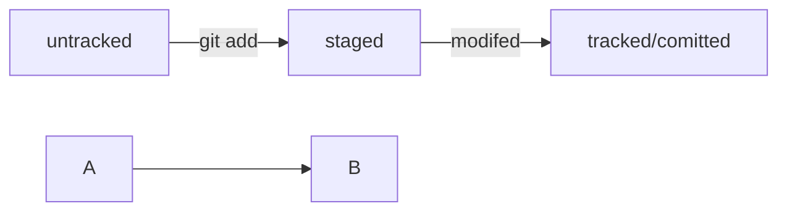

# Шпаргалка git

## **Инициализация репозитория**
```git init```
(от англ. initialize, «инициализировать») - инициализируй
репозиторий.
## **Подготовка файла к коммиту**
(от англ. add, «добавить») - подготовь файл
```git add todo.txt```
коммиту;
todo. txt
K
```git add --all``` 
(от англ. add, «добавить» + all, «всё») — подготовь к коммиту сразу
все файлы, в которых были изменения, и все новые файлы;
```git add```
- подготовь к коммиту текущую папку и все файлы в ней.
## **Создание коммита**
```git commit -m``` "Комментарий к коммиту."
(от англ. commit, «совершать»,
«фиксировать» + message, «сообщение») - сделай коммит и оставь комментарий,
чтобы было проще понять, какие изменения внесены.
Просмотр информации о коммитах
(от англ. /од, «журнал [записей]») — выведи подробную историю коммитов.
```git log```

## **Просмотр состояния файлов репозитория.**
```git status```
(от англ. status, «статус», «состояние») - покажи текущее состояние
Синхронизация локального и удалённого репозиториев

```git remote add origin https://github.com/YandexPracticum/first-project.git``` 
(от англ. remote, «удалённый» + add, «добавить») — привяжи локальный репозиторий 
к удалённому с URL https://github.com/YandexPracticum/first-project.git;
```git remote -v``` (от англ. verbose, «подробный») — проверь, что репозитории действительно связались;
```git push -u origin main``` (от англ. push, «толкать») — в первый раз загрузи все коммиты из локального репозитория в удалённый с названием origin.
💡 Ваша ветка может называться master, а не main. Подправьте команду, если это необходимо.
```git push``` (от англ. push, «толкать») — загрузи коммиты в удалённый репозиторий после того, как он был привязан с помощью флага -u.

## **Клонирование**
```git clone git@github.com:TheGreatOwner/the-great-project.git``` 
(от англ. clone, «клон», «копия») — склонируй репозиторий с URL the-great-project.git 
из аккаунта TheGreatOwner на мой локальный компьютер.
## **Форк**
**Форк** — операция, которая не связана с Git напрямую и выполняется через графический интерфейс GitHub (кнопка Fork в правом верхнем углу страницы репозитория). «Форк» создаёт независимую копию репозитория со всеми файлами, коммитами и ветками в аккаунте GitHub. Такая копия будет полностью независима. Внесённые изменения не будут синхронизированы с исходным репозиторием.
💡 Комбинацию **форк** + **_clone_** часто используют для внесения изменений в публичные репозитории. В этом случае **форк** становится подготовительным этапом перед клонированием чужого репозитория на локальный компьютер.
Если репозиторий приватный или это репозиторий вашей компании, при работе с ним достаточно **_clone_**.
## **HEAD**
**HEAD** - это файл в ```.git```, в файле - ссылка, по ссылке - хеш. Это синоним хеша **последнего** коммита.
Если передать его в качестве параметров, git поймет вас
**Хеш** — идентификатор коммита 
**Хеширование** (от англ. hash, «рубить», «крошить», «мешанина») — это способ преобразовать набор данных и получить их «отпечаток» (англ. fingerprint).
**Информация о коммите** — это набор данных: когда был сделан коммит, содержимое файлов в репозитории на момент коммита и ссылка на предыдущий, или родительский (англ. parent), коммит. Git хеширует (преобразует) эту информацию с помощью алгоритма SHA-1 (от англ. Secure Hash Algorithm — «безопасный алгоритм хеширования») и получает для каждого коммита свой **уникальный хеш — результат хеширования.**
Если хеш получить дважды для одного и того же набора входных данных, то результат будет гарантированно одинаковый;
Если хоть что-то в исходных данных поменяется (хотя бы один символ), то хеш тоже изменится (причём сильно).
Git хранит таблицу соответствий хеш → информация о коммите. Если вы знаете хеш, вы можете узнать всё остальное: автора и дату коммита и содержимое закоммиченных файлов. Можно сказать, что хеш — основной идентификатор коммита.
При работе с Git хеши будут встречаться вам регулярно. Их можно будет передавать в качестве параметра разным Git-командам, чтобы указать, с каким коммитом нужно произвести то или иное действие.
Все хеши и таблицу хеш → информация о коммите Git сохраняет в служебные файлы. Они находятся в скрытой папке .git в репозитории проекта.

**Исследуем лог**

После вызова ```git log``` появляется список коммитов с их описанием.
Вот из каких элементов состоит описание:
1) Строка из цифр и латинских букв после слова commit — это уже знакомый вам хеш коммита.
2) Author — имя автора и его электронная почта.
3) Date — дата и время создания коммита.
4) Сообщение к коммиту.
Вот так выглядит описание первого коммита в репозитории Git
1) ```commit e83c5163316f89bfbde7d9ab23ca2e25604af290```
2) ```Author: Linus Torvalds <torvalds@linux-foundation.org>```
3) ```Date:   Thu Apr 7 15:13:13 2005 -0700```
4)  ```Initial revision of "git", the information manager from hell```

Если в репозитории уже много коммитов — например, сотни или тысячи, — пригодится **сокращённый лог**. С ним можно быстро найти нужный коммит по описанию.
**Сокращённый лог** вызывают командой ```git log``` с флагом ```--oneline``` (англ. «одной строкой»). При этом в терминале появятся только первые несколько символов хеша каждого коммита и комментарии к ним.
**Сокращённый хеш** (первые несколько символов полного) можно использовать точно так же, как и полный. Для этого команда ```git log --oneline``` автоматически подбирает такую длину сокращённых хешей, чтобы они были уникальными в пределах репозитория и Git всегда мог понять, о каком коммите идёт речь.
💡 Обратите внимание: если выход из просмотра логов не произошёл автоматически, нажмите клавишу Q (от англ. Quit — «выйти») в английской раскладке клавиатуры.


**Оформление сообщений к коммитам**
То, как написаны сообщения к коммитам, тоже может подчиняться определённым правилам. Иногда эти правила продиктованы культурой команды, а иногда техническими ограничениями. Например, в выводе команды ```git log --oneline``` умещается максимум 72 первых символа сообщения, поэтому многие правила включают пункт: «Сообщение не должно быть длиннее 72 символов».
У каждого коммита в Git есть сообщение — то, что передаётся после параметра ```-m```. Например: ```git commit -m "Добавить урок про оформление сообщений коммитов"```
Сообщение коммита должно помочь определить, что внутри. Например, надпись «всякое разное» не очень полезная. Сообщение коммита «небольшие исправления» тоже: непонятно, что было исправлено в таком коммите и зачем.
Есть **общие рекомендации** по тому, как правильно составить сообщение. Оно должно быть:
1) ***относительно коротким***, чтобы его было легко прочитать
2) ***информативным***
Вот пример **полезного сообщения** в репозитории новостного сайта: ***"Исправление опечатки в заголовке главной страницы на хорватском"***. Такое сообщение даёт много информации:
Исправление опечатки значит, что исправлена ошибка, которая была допущена при наборе. Такое исправление не меняет смысл. То есть, например, главному редактору не нужно перепроверять этот заголовок.
На хорватском говорит о том, что переводчикам на другие языки этот коммит можно смело пропускать.
В заголовке главной страницы указывает, где произошли изменения. Если, например, кто-то зайдёт на сайт и ему не понравится новый заголовок, он легко найдёт по истории (```git log```) автора этого коммита и спросит у него, почему заголовок теперь такой.
Пример **плохого сообщения** для того же коммита: ***"Исправлена опечатка."*** Это сообщение даёт мало информации. В такой коммит придётся «заглядывать» — разбираться, что именно поменялось и зачем.